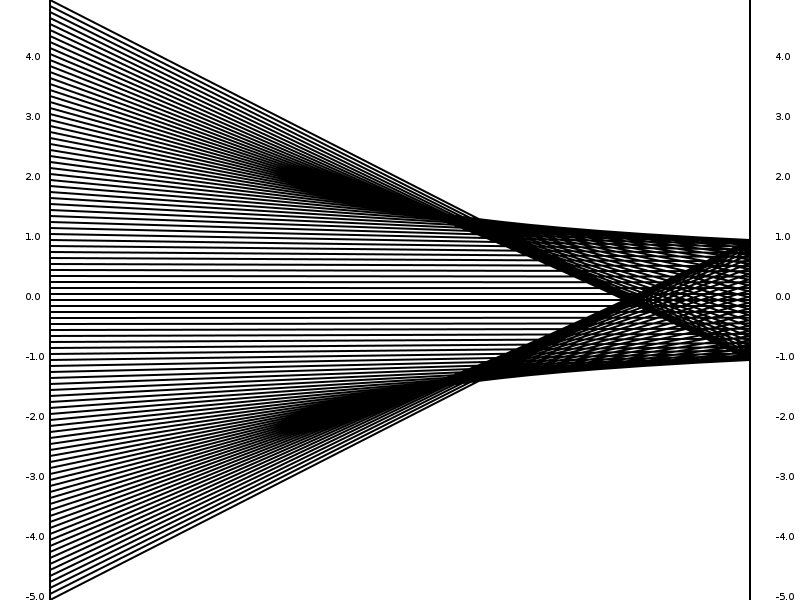

=======
Funcmap
=======

Funcmap is a program to graph a functions input to its output, where its input
and output are represented by two number lines. Here's an example for the sine
function.

Pretty neat, right? This program was based off of an excersize my calculus
teacher had the class do. Its purpose is to show patterns in functions that
we don't see using normal graphing methods.
